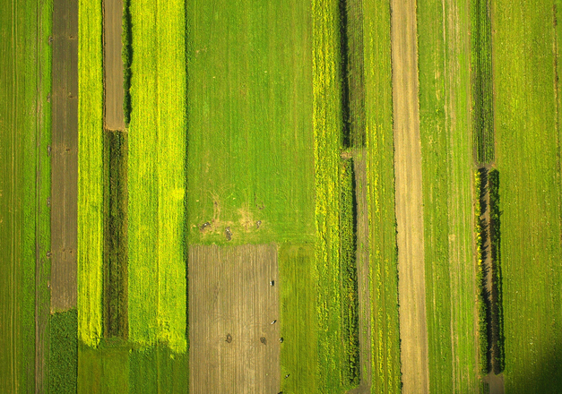

Flashybox
======================

A small (less than 3 KB gzipped!) jQuery (2.x) plugin to show fixed size image collage with fading images. You just provide list of images in a markup and call `flashybox()` on it and it'll covert images into flashybox wall.

###Example


Click here to view [demo GIF](http://i.imgur.com/u0si8hg.gifv).

###Usage
---
Download the tarball and extract it, include `jquery.flashy.js` after including `jquery` using `script` tag in your page `<head>`.
```html
<!DOCTYPE html>
<html lang="en">
<head>
    <meta charset="UTF-8">
	<title>My Flashy Page</title>
	...
	...
	<script type="text/javascript" src="js/jquery.js"></script>
	<script type="text/javascript" src="js/jquery.flashy.js"></script>
</head>
```

For the sake of convenience, Flashybox is also made available as an NPM module (since it supports CommonJS-style loading). Install it using `npm`
```javascript
npm install flashybox --save
```


###Use
---

####Basic Usage
- **Initialize:**
You'll need all your images in the markup either directly within a `div` or in a `ul` as follows (any parent element will do as long as you use `` for images). Be sure that you have `flashybox-container` class specified in your parent.

```html
<div class="flashybox-container">
	
	
	
	
	
	
	
	
	
	
</div>
```

This is just a temporary markup and flashy will replace it using built-in template.

- **Call:**
Flashybox provides a method `flashybox()` which optionally accepts `config` map to provide certain options.

```javascript
<script type="text/javascript">
	$(function() {
	    $('.flashybox-container').flashybox({
            boxWidth: 300,                  // Width in Px to Keep for each Flashy Box containing images (Default: 300).
            boxHeight: 250,                 // Height to keep for each Flasy Box (Default: 250).
            flashInterval: 3000,            // Interval in MS to wait before flash (Default: 3 sec).
            animationDuration: "slow",      // Duration for animation; value can be anything that jQuery fadeIn/fadeOut duration supports (Default: "slow").
            flashAllAtOnce: false,          // Flash all Images at Once (Default: false).
            flashAtOnce: 1                  // Provide number of images to flash at once (applicable only if flashAllAtOnce is false, Default: 1).
	    });
	});
</script>
```

### Known Issues
---

 - For Consistency in box size, Flashybox forces image resize in blocks, obviously it requires some CSS wizardry to keep image aspect-ratio intact along with consistent box size, but my intention is to keep the plugin simple to understand and hack. However, pull-requests are welcome.

###Version Information
---
* 0.1.0 - First Release.

###Author
---
[Kushal Pandya](https://doublslash.com)
